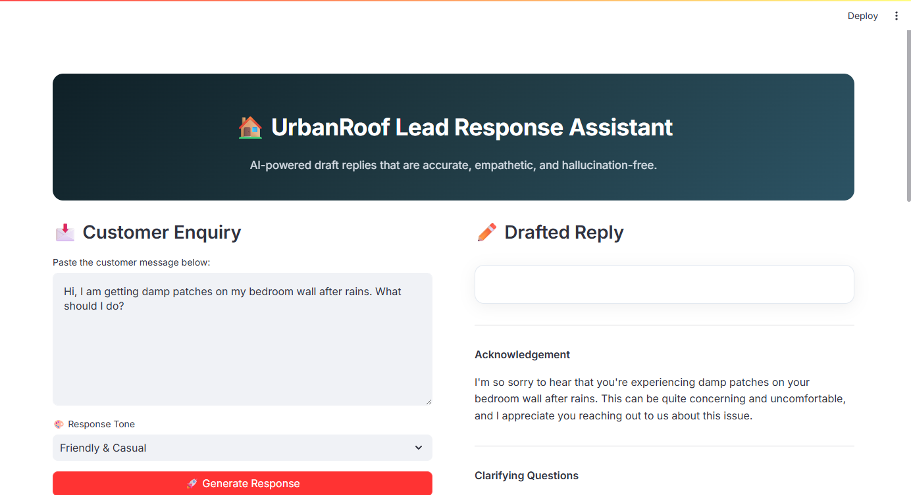

# UrbanRoof Lead Response Assistant 🏠

An AI-powered workflow that reads a customer enquiry and drafts a helpful, human-sounding reply — built with Python, Streamlit, and Groq (Llama 3.3 70B).

---

## Screenshots

### Main Interface


### AI-Generated Response


---

## Features

| Feature | Description |
|---|---|
| **Intent Detection** | Understands the core customer issue |
| **Clarifying Questions** | Asks 2-3 relevant follow-up questions |
| **Safe Advice** | Provides actionable steps without false promises |
| **No Hallucinations** | System prompt strictly forbids fabricating data |
| **No Diagnosis** | Never assumes or guesses the cause of the problem |
| **Tone Selection** | Choose between Friendly, Formal, or Empathetic tones |

---

## Tech Stack

- **Python 3.10+**
- **Streamlit** — Interactive web UI
- **Groq API** (Llama 3.3 70B) — Fast LLM inference
- **python-dotenv** — Secure API key management

---

## How to Run

```bash
# 1. Clone the repository
git clone https://github.com/ShreyashPatil530/lead-response-assistant.git
cd lead-response-assistant

# 2. Install dependencies
pip install -r requirements.txt

# 3. Create a .env file with your Groq API key
echo "GROQ_API_KEY=your_groq_api_key_here" > .env

# 4. Run the app
streamlit run app.py
```

The app will open in your browser at `http://localhost:8501`.

---

## How It Works

```
Customer Enquiry → System Prompt + Tone → Groq API (Llama 3.3 70B) → Structured Reply
```

1. User pastes a customer enquiry into the text area.
2. Selects a response tone (Friendly / Formal / Empathetic).
3. The enquiry + a carefully engineered **system prompt** are sent to Groq's Llama 3.3 70B model.
4. The system prompt enforces a structured response:
   - **Acknowledgement** — empathetic recognition of the concern
   - **Clarifying Questions** — neutral follow-ups to gather info
   - **Suggested Next Steps** — safe, general advice
   - **Closing** — warm professional sign-off

---

## Accuracy & Reliability

| Guardrail | How It Works |
|---|---|
| **No Hallucinations** | System prompt explicitly forbids fabricating any data |
| **No Diagnosis** | Never guesses or assumes the root cause |
| **No False Promises** | Never offers guarantees, timelines, or pricing |
| **Neutral Language** | Only mentions specifics the customer raised |
| **Low Temperature (0.5)** | Keeps responses grounded while sounding natural |

---

## Known Limitations

- Relies on Groq API availability and rate limits.
- Responses are drafts — a human agent should review before sending.
- No conversation memory (each enquiry is treated independently).
- Cannot access real product catalogs or pricing databases.

---

## What I Would Improve With More Time

- **Multi-turn conversation** — Let the agent refine responses iteratively.
- **RAG integration** — Connect to a real knowledge base.
- **Response scoring** — Auto-evaluate for hallucination risk.
- **CRM integration** — Push drafts directly into a CRM system.
- **Analytics dashboard** — Track common enquiry types.

---

## Author

**Shreyash Patil** — UrbanRoof Assignment  
Powered by Groq (Llama 3.3 70B) + Streamlit
